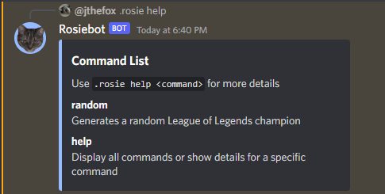
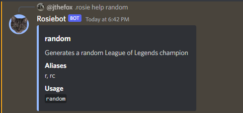
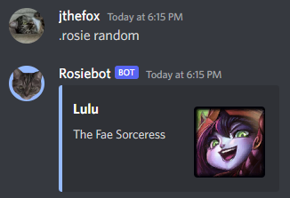
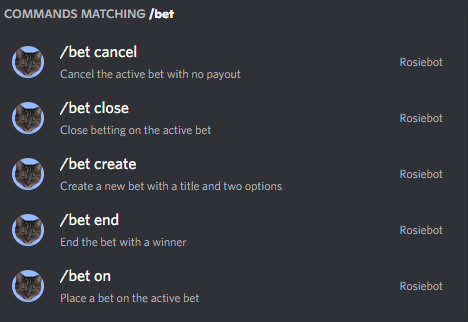
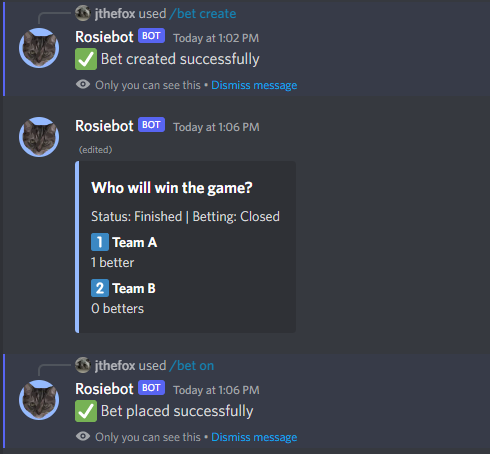
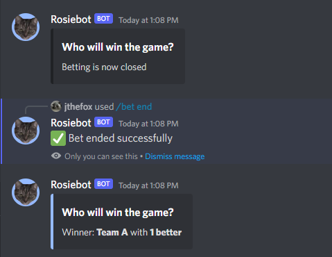

# Rosiebot

1. [Features](#current-features)
2. [Commands](#commands)
3. [Future Updates](#future-updates)

Rosiebot is a personal use discord bot created in JavaScript based on the template I created. I do not have any current plans to make the bot public so there is no invite link, but I may make a public bot in the future.

## Current Features
- Slash commands
- Per-guild persistent data
- Betting
- Bot management operations CLI

## Commands
`help` - Displays all commands or shows details for a specific command 

`random` - Generates a random League of Legends champion 

`/bet` - Betting feature interface 
 

## Future Updates
**Features**:
- Persistent data for guild member's bet scores
- Ability to set the bet close timer in slash command options
- Improvements to bet displays
- Website for the bot

**Commands**:
- Change bot command prefix
- Duel command between 2 users
- Flip a coin 
- Rock, paper, scissors between 2 users
